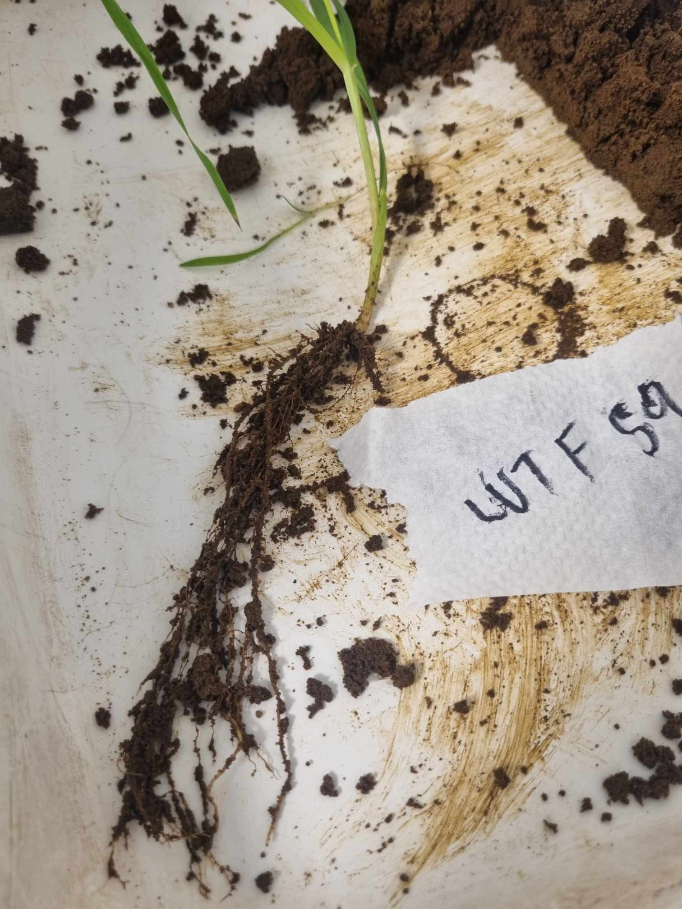
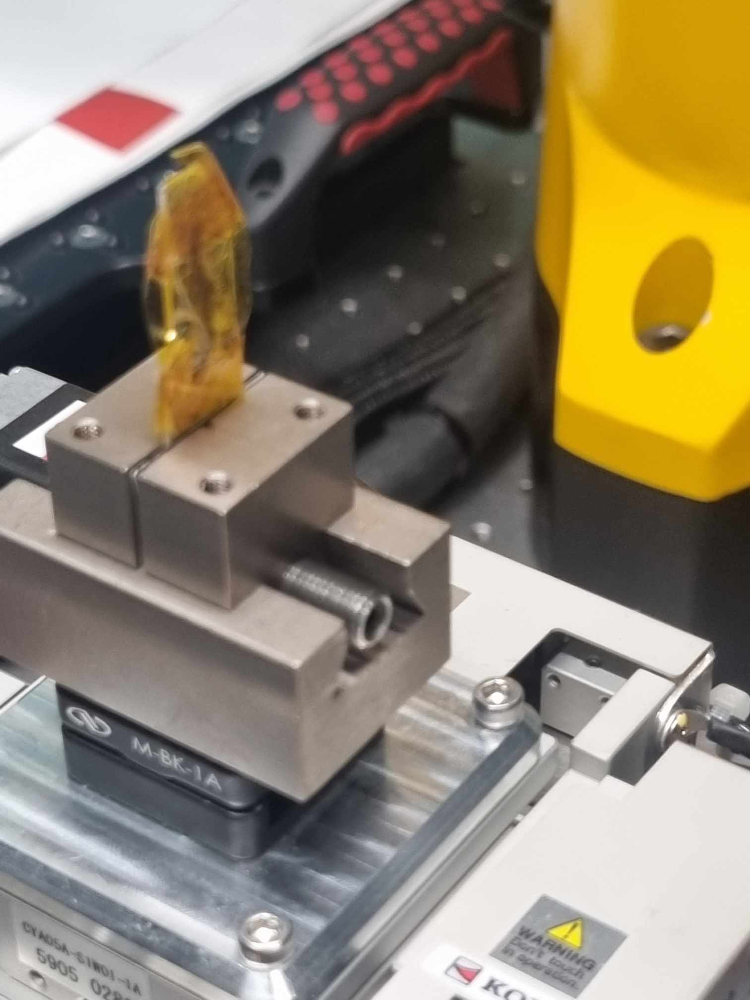
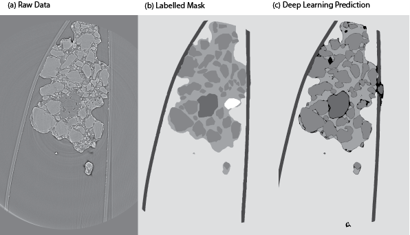
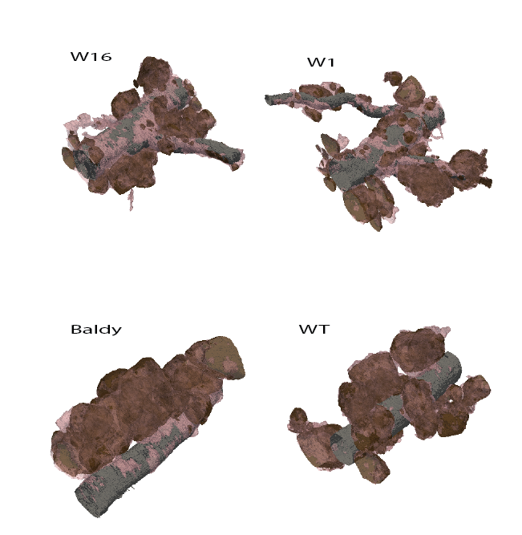
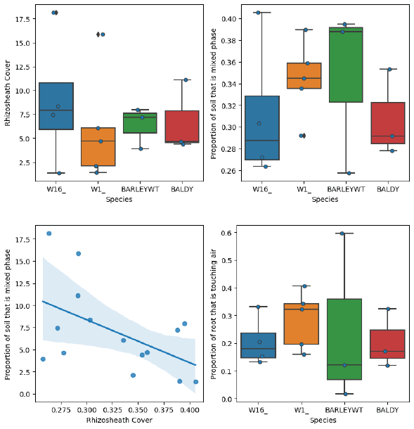

# Imaging-The-Rhizosheath-
##### This is a work in progress document being shared in its early stages in case it helps anyone, collaborations are very welcome :)

## Authors: [Richard Harwood](https://richardharwood.github.io./) and [Devin A. Rippner](https://functionalsoilhealth.com/) 

### Introduction
Soil has been referred to as the most complex biomaterial on earth (Young and Crawford 2004), this complexity is increased when the focus is on the plant-soil interface. It is well understood that soil structure and soil biota influence soil health and that plant root architecture and root exudates are influential. The most obvious way that plant roots change soil structure is through physical force. As a plant root navigates through the soil it changes not just the physical structure but also the chemical and biological properties in its immediate vicinity (Hinsinger 2009). During root growth a distinct volume of soil often adheres to the plant root called the rhizosheath, and immediately adjacent to this is an area of soil called the rhizosphere that is distinctly different to bulk soil which is further away from the root system. The rhizosheath and rhizosphere have a very interesting implication: they show that a small volume of soil that is close too, but not touching, the root system can have different structural, chemical, and biological properties to near-by bulk soil. In this distinct volume of soil, bacteria form microaggregates by binding soil particles together with their secretions (Ingham 2009). Examples of root morphology include the presence and size of root hairs, the length of roots along with their branching properties. Examples of rhizosheath properties include the amount of soil adhering to the root and root hairs along the with the proportion of the root covered in soil. Rhizosheath soil can also have a different pore network, different soil aggregate sizes and microbial community. These root and rhizosheath traits change a plants capacity to uptake water and nutrients allowing the plant to tolerate water deficits, heat stress and limited nutrient availability.
stress and limited nutrient availability.
 
A popular tool for understanding the root soil interface is MicroCT. For example, Duddek et al., (2023) created custom chambers to grow roots into small chambers so that they could image maize roots at a resolution where they could identify root hairs. However, without some sort of destructive technique there is no clear way to distinguish rhizosheath. This is because by definition the rhizosheath is the volume of soil that adheres to the root system after being excavated and shaken to remove non-adhering bulk soil (Brown et al., 2017). Therefore, rhizosphere refers to the soil affected by the root activities, which by definition includes the rhizosheath. So, rhizosheath is a portion of the rhizospheric soil that remains on the roots after being taken out from the soil (Cheraghi et al., 2023). In other words, it is now agreed that every rhizosheath soil volume is rhizosphere, but not all rhizosphere soil is rhizosheath. 
Rhizosheath formation is underpinned by 4 key processes, in no order:  
1) the properties of host soil  
2) mucilage and exudate deposits from the plant roots  
3) microbial activity  
4) root hairs  
 
Together these root-soil traits should create an environment that is ideal for plant growth. A simple model of rhizosheath formation is that root hairs navigate the soil pore space and adhere to soil aggregates, the adhesion is secured by mucilage (a sticky substances excreted by the plant roots) and this forms the basis of the rhizosheath. Overtime microorganisms consume exudates creating textural biomaterial along with necro mass which further adds to the rhizosheath formation.   

 
The benefit of using a synchrotron for MicroCT is speed. For example, Duddek et al., (2023) needed to cut off their small root chambers prior to scanning. In a conventional desk top CT scanner, the scan time would be so long such that the root and root hairs would desiccate. However, give the scan time is less than 10 minutes the artefacts from a destructive harvest are minimal. Another example of the benefit of using a synchrotron is studying leaves, leaves can be quickly chopped, wrapped in Kapton tape and imaged before they dried out. Here we show how the established methods for imaging leaves can be leveraged to image the rhizosheath. We extract the rhizosheath, quickly and delicately wrap it in Kapton tape and image the rhizosheath, all within a few minutes. We then take this 3D structural information to better understand the mechanisms behind rhizosheath formation. To complement this, we include lower resolution data to compare the rhizosheath to the rhisozphere 

### Methods
Plant Growth:
Plants were grown in a constant temperature room. We chose to explore the following plants:

| Plant:  | Justification: |
| ------------- | ------------- |
| Wheat (W1) | Longer more dense root hairs  |
| Wheat (W16)  | Shorter less dense root hairs  |
| Barley WT | Barley with root hairs  |
| Barley Baldy  | Barley root hair mutant (no root hairs)  |

Extraction and Sample preparation:
The root system was delicately removed from a 15mm irrigation riser (custom pot) and gently shaken to separate rhizosphere and bulk soil from the rhizosheath. 

 

A representative piece of root with rhizosheath soil was sampled with a razor blade and delicately wrapped in Kapton. 

 

and then imaged 

 

Image segmentation using deep learning: 
We segmented the images into 5 classes using a published deep learning workflow. The classes were “kapton”, “root”, “mixed phase”, “primary minerals” and “background”.   

 

The model is described here [“A workflow for segmenting soil and plant X-ray computed tomography images with deep learning in Google’s Colaboratory”](https://www.frontiersin.org/articles/10.3389/fpls.2022.893140/full)by Rippner et al (2022). We trained the model on google colab (to get acess to an A100 GPU (40gb VRAM). But then downloaded that model and ran the segmentation on the bulk of the data locally (see segment_4x_fcn.ipynb in scripts). The same principle applies to the scans of the whole PVC riser at 6.5um except the materials were (“background”, “root”, “soil”, “pore”).  

The movie below breaks down what was imaged and segmented.
| Object:  | Colour: |
| ------------- | ------------- |
|  Root | grey |
| Root Hairs | red |
| Primary phase consisting of larger particles with undetectable internal porosity|brown|
| Mixed phase consisting of smaller water-filled pores and solid particles of the silt and clay fractions | pink |
| Organic Matter  |green |

 

Quantifying traits from segmented images.
The goal of this imaging was to better understand what causes soil to adhere to plant roots (that is, the rhizosheath). And how plant roots alter the soil (changes in the rhizosphere) To unpack this we quantified the following:  

| Trait quantified:  | Explanation: |
| ------------- | ------------- |
| Rhizosheath volume per root volume| The volume of rhizosheath soil / the volume of root  |
| Mixed proportion | The proportion of rhizosheath that is “mixed”  |
| Proportion touching pore space| Barley The proportion of root surface area touching pore space |

The notebook wrangle_4_x_whitebeam.ipynb documents each analysis step. 

### Results and Discussion: 
Here we present high resolution “snippets” of the rhizosheath, focussing on the root-soil interface. 

 

By definition the soil imaged here should be distinctly different to bulk soil, furthermore it should be slightly different to rhizosheath soil  (that is soil that is as close to the root but fell of the root when gently shaken). A soils overall health is linked, in part, to the size, shape, density and connectiveness of its airspaces. The 3D architecture of a soil influences the rate, flow and retention of water and solutes (Luo et al., 2010). Given the importance of both pores and rhizosheath it is evident that plants need to strike a balance in the amount of soil that covers the root and the porosity of that soil (Schmidt et al. 2012). Root hair length and root hair density would influence this balance. For example, a plant with long and dense root hairs would have an interface with the pores in the rhizosheath (e.g. Duddek et al 2023). Whilst a plant with no root hairs would only have an interface with the soil and pores immediate to the main root.
 
With a growing body of 3D root-soil data is timely to consider what the “perfect” soil structure looks like. For example, if a soil has large pores, this offers the path of least resistance to an emerging root but offers limited capacity to ensure plant health. Alternatively, soil with small infrequent unconnected pores seems ideal to increase root-soil cover but may lack the appropriate conditions for water transport and microbial well-being. Assumably, in areas where rhizosheath is formed we get a “snapshot” of what an ideal functioning soil structure, that is, a soil which maintains a sufficient network to allow air, water, and nutrients to access the roots and root hairs if present. 
 

The destructive rhizoheath samples had a large range of rhizosheath mass. It is important to note that on such a small scale it is tenuous to compare rhizosheath cover across the plants. Rather, it is a better approach to compare the traits that a generalized to contribute to rhizosheath formation (most notably root hair length and density) to our high resolution 3D models. In theory we would expect that W1 (longer more dense root hairs) would have a higher rhizosheath mass than W16 (shorter less dense root hairs), similarly the Barley WT should have more rhizosheath mass than the brb mutant. Given the minute sub-volume a lot is left to chance compared to a study such as Rabbi et al where entire root systems were investigated. What we capture at this scale is the root-soil interface and that is the results we will discuss. For example, the rhizosheath of W16 plants is on average made up of a lower proportion of mixed phase soil, and in general the proportion of mixed phase is negatively correlated with rhizosheath mass. Interestingly, there is no relationship between the proportion of root that is touch is air  and rhizosheath mass. Perhaps a naïve assumption but one would assume that the more soil actually touching the surface of the plant root would create more opportunity for soil to “stick”, resulting in a greater rhizosheath mass.  

 

